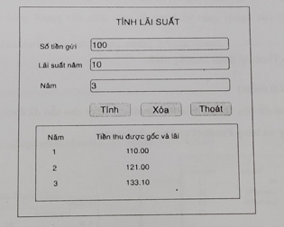
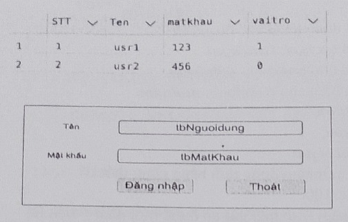
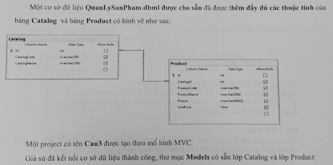
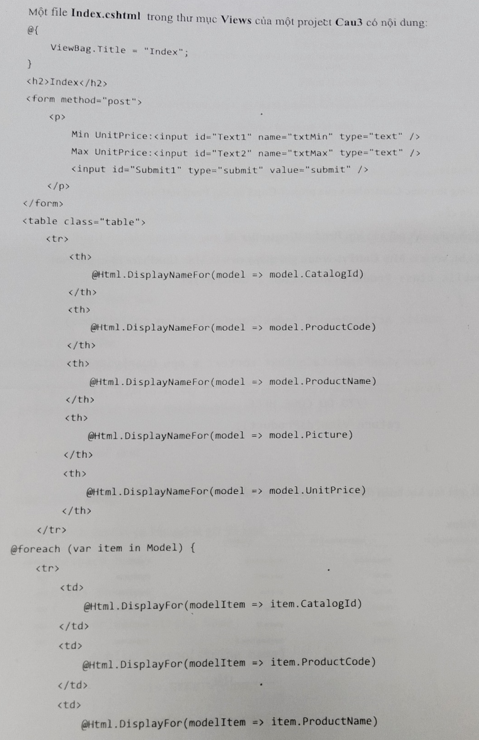
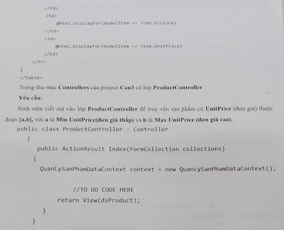
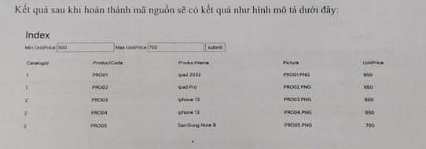

# 2022 - 2023 - HK1
## Phần 1:
### Bài l: viết hàm kiểm tra năm nhuận
``` csharp
public static bool IsLeapYear(int year)
{
    return (year % 400 == 0) || (year % 4 == 0 && year % 100 !=0)
}
```
#### hoặc:
``` csharp
public static bool IsLeapYear(int year)
{
    if ((year % 400 == 0) || (year % 4 == 0 && year % 100 !=0)) return true;
    else return false;
}
```

### Bài 2: viết phương thức đảo ngược chuõi
#### Trong C#, string là immutable (bất biến) -> không thể thay đổi nội dung của một string sau khi nó được tạo ra. Suy ra, đổi qua array
``` csharp
private static void ReverseString(string a)
{
    char[] charArray = a.ToCharArray();
    Array.Reverse(charArray);
    string a_reversed = new string(charArray);
}
```

### Bài 3:
``` csharp
namespace Name
{
    class Person
    {
        private string Name;

        public Person(string name)
        {
            this.Name = name;
        }
        
        private void ShowSecret()
        {
            Console.WriteLine("Your name: " + Name);
        }

        private static void DoSomething(String job)
        {
            Console.WriteLine("Do job: " + job);
        }
    }

    class Diary
    {
        public void Logging()
        {
            DoSomething("Code Csharp");
            ShowSecret();
        }
    }

    class Test
    {
        public static void Main(string[] args)
        {
            Person a = new Person("Tom");
            String name = a.Name;
            a.ShowSecret();
            Person.DoSomething();
        }
    }
}
```
#### Kết quả của chương trình này là: Không biên dịch được (Compile erorr), tại vì các lỗi như sau:
+ "String name = a.Name;" và "a.ShowSecret();" lỗi các dòng này, private chỉ có thể truy cập được trong class Person
+ "DoSomething()" và "ShowSecret" là class của Person không thể truy cập từ Diary
+ Person.Dosomthing(); trong Main cần một tham số kiểu String (nếu các lỗi trên được ghi rõ access modifier thì đây là lỗi chính của bài)
#### Trong C#, nếu không ghi rõ access modifier (public/private), thì mặc định là private TRONG class

### Bài 4: Khởi tạo và sử dụng Delegate có kiểu int và tham số truyền vào có kiểu string cho mỗi phương thức ConvertStringToInt và ShowString 
``` csharp
using System;

public class Program
{
    // Khai báo kiểu dữ liệu delegate
    public delegate int StringProcessor(string stringValue);
    // kiểu trả về "int", kiểu truyền vào "string"

    static int ConvertStringToInt(string stringValue)   // trả về số tương ứng được ghi từ dạng string
    {
        return int.TryParse(stringValue, out int result) ? result : 0;
    }

    static int ShowString(string stringValue)           // hàm này phải trả về int nên dữ liệu được chọn là độ dài chuỗi
    {
        Console.WriteLine(stringValue);
        return stringValue.Length;
    }

    public static void Main()
    {
        // Khởi tạo delegate
        StringProcessor converter = ConvertStringToInt;
        StringProcessor shower = ShowString;
        
        // Sử dụng delegate
        int num = converter("123");
        int length = shower("Hello");
        
        Console.WriteLine($"Số: {num}, Độ dài: {length}");
    }
}
``` 

## Phần 2:
### Câu 1: 
Viết phương thức tính tiền lãi khi gửi tích kiệm tại ngân hàng
Chương trình cho phép người dùng nhập vào ba giá trị:
+ số tiền gửi có tên biến cho ô textbox: txttiengui
+ lãi suất năm (%) có tên biến cho ô textbox: txtlaixuat
+ Số năm gửi tiền tích kiệm có tên biến cho ô textbox: nudnam
+ Button Tính có tên biến: bttinh
+ Button Xoá có tên biến: btxoa
+ Richtextbox có tên biến: rtbketqua 

Tiền lãi người gửi nhận được mỗi năm được tính theo công thức: Tiền lãi = tiền gửi * lãi suất / 100 </br>
Tiền lãi = số tiền gửi * lãi suất / 100 </br>
Tiền thu được gốc và lãi mỗi năm = số tiền gửi có được mỗi năm + tiền lãi </br>
Tiền thu được gốc và lãi cho năm hiện tại được dùng làm số tiền gửi cho năm tiếp theo </br>

**Mô tả:** </br>
    Số tiền gửi = 100 </br>
    Lãi suất năm = 10 </br>
    Năm = 2 </br>
Thì: </br>
    Tiền thu được gốc và lãi năm 1 = 100 + 100x10/100 = 110 </br>
    Tiền thu được gốc và lãi năm 2 = 110 + 110x10/100 = 121 </br>
    Kết quả số tiền gốc và lãi có thể có hoặc không có số thập phân: 110 = 110.0 = 110.00 </br>
  
**Yêu cầu:** Chỉ cần viết phương thức xử lý cho sự kiện
+ Button Tính sẽ tính kết quả trả về bằng Richtextbox như hình trên
+ Button Xoá sẽ đưa về trạng thái như lúc ben đầu (tất cả các ô textbox đều rỗng)
+ Button Thoát sẽ thoát chương trình

#### Bài làm:
``` csharp
// Phương thức tính lãi suất
private void bttinh_Click(object sender, EventArgs e)
{
    // Lấy giá trị từ các control
    double tienGui = Convert.ToDouble(txttiengui.Text);
    double laiSuat = Convert.ToDouble(txtlaixuat.Text);
    int soNam = (int)nudnam.Value;
    
    // Thêm tiêu đề
    rtbketqua.Text = "Năm\tTiền thu được gốc và lãi\n"; // fomat cho đúng vị trí trên bảng
    
    // Tính toán và hiển thị kết quả
    double tienHienTai = tienGui;
    for (int nam = 1; nam <= soNam; nam++){
        double tienLai = tienHienTai * laiSuat / 100;
        double tongTien = tienHienTai + tienLai;
        rtbketqua.AppendText($"{nam}\t{tongTien:F2}\n"); // in kết quả lên bảng (\t cách nhau 1 tab)
        
        tienHienTai = tongTien; // reset tiền năm tiếp theo = tiền đã tính lãi năm hiện tại
    }
}

// Phương thức xóa dữ liệu
private void btxoa_Click(object sender, EventArgs e)
{
    // clear tất cả các ô -> đều rỗng 
    txttiengui.Clear();
    txtlaixuat.Clear();
    nudnam.Clear(); 
    rtbketqua.Clear();
}

// Phương thức thoát chương trình
private void btthoat_Click(object sender, EventArgs e) {Application.Exit();}
```

### Câu 2:
Giả sử kết quả một bảng database của USER trong database source SGU là QLSV.dbo, cơ sở dữ liệu lưu trữ tại vị trí SGU\SQLEXPRESS được xây dựng sẵn và một form đăng nhập như hình: </br>

+ **Tên** có tên biến cho ô textbox: tbNguoidung
+ **Mật khẩu** có tên biến cho ô textbox: tbMatKhau

**Yêu cầu:** </br>
- Viết phương thức thực hiện cho button **Đăng Nhập**,
    + khi người dùng nhập đúng tên và mật khẩu đồng thời kiểm tra nếu vai trò là 0 trong bảng cơ sở dữ liệu thì mở giao diện người dùng trong đó giao diện người dùng đã được cung cấp sẵn có tên **fmUsr**
    + khi người dùng nhập đúng tên và mật khẩu đồng thời kiểm tra vai trò là 1 trong bảng cơ sở dữ liệu thì mở giao diện của người quản trị trong đó giao diện của người quản trị đã được cung cấp sẵn có tên **fmAdmin**
    + Button Thoát sẽ thoát chương trình

#### Bài làm: Giả sử gọi giao diện đang thao tác là: LoginForm và ô Button Đăng nhập có tên biến là: btnDangNhap_CLick
``` csharp
private void btnDangNhap_Click(object sender, EventArgs e)
{
    // Lấy thông tin từ các ô textbox 
    string username = tbNguoidung.Text;
    string password = tbMatKhau.Text;
    
    // Chuỗi kết nối database (DỮ LIỆU TỪ ĐỀ BÀI)
    string connectionString = @"Data Source=SGU\SQLEXPRESS;Initial Catalog=QLSV;Integrated Security=True";
    
    // Kết nối và kiểm tra đăng nhập
    using (SqlConnection connection = new SqlConnection(connectionString))
    {
        connection.Open();
        // Câu truy vấn kiểm tra
        string query = "SELECT VaiTro FROM dbo.[USER] WHERE TenDangNhap = @Username AND MatKhau = @Password";
        
        using (SqlCommand command = new SqlCommand(query, connection))
        {
            // Truyền tham số để tránh SQL Injection
            command.Parameters.AddWithValue("@Username", username);
            command.Parameters.AddWithValue("@Password", password);
            
            // Thực thi và lấy kết quả
            object result = command.ExecuteScalar();
            
            // Kiểm tra và phân quyền
            if (result != null)
            {
                int vaiTro = Convert.ToInt32(result); // chuyển về dạng int để kiểm tra
                // Ẩn form đăng nhập hiện tại
                this.Hide();
                // Mở form tương ứng theo vai trò
                if (vaiTro == 0)
                {
                    fmUser userForm = new fmUser();
                    userForm.Show();
                }
                else if (vaiTro == 1)
                {
                    fmAdmin adminForm = new fmAdmin();
                    adminForm.Show();
                }
            }
        }
    }
}
```


### Câu 3: Đề bài *TooLongDidntRead*
 </br>
 </br>
 </br>


#### Bài làm:
``` csharp
public class ProductController : Controller
{
    public ActionResult Index(FormCollection collections)
    {
        QuanLySanPhamDataContext context = new QuanLySanPhamDataContext();
        // Khai báo và parse giá trị từ form
        double a = 0, b = 0;
        double.TryParse(collections["txtMin"], out a); 
        // chuyển đổi chuỗi thành số -> nếu thành công gán cho a
        double.TryParse(collections["txtMax"], out b);
        // chuyển đổi chuỗi thành số -> nếu thành công gán cho b

        // truy vấn LinQ 
        var dsProduct = context.Products.Where(p => p.UnitPrice >= a && p.UnitPrice <= b).ToList();
        // lấy ra sản phẩm p có đơn giá UnitPrice trong đoạn [a, b]
        return View(dsProduct);
    }
}
```


