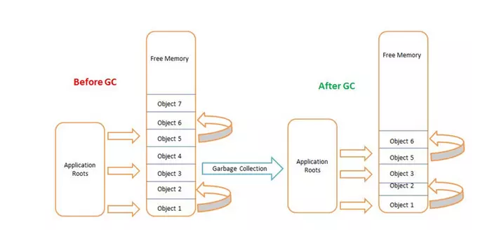
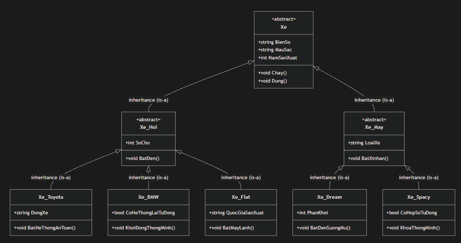
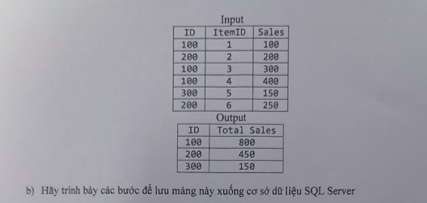

# 2022 - 2023 CLC - HK1
## Phần 1:
### Bài l: 

#### Bài làm:
a. Cửa sổ Properties (Thuộc tính) trong Visual Studio dùng để:
+ Xem và chỉnh sửa thuộc tính của control/đối tượng được chọn
+ Thay đổi thuộc tính thiết kế như: Name, Text, Size, Location, Font, Color, v.v.
+ Quản lý sự kiện (Events) - double-click để tạo event handler
+ Phân loại thuộc tính theo nhóm (Appearance, Behavior, Data, Layout, v.v.)
+ Hiển thị mô tả của từng thuộc tính ở dưới cùng cửa sổ

b. Sử dụng lệnh gì để đóng form hiện tại của ứng dụng ?
``` csharp
this.Close();
```

c. Chuyện gì xảy ra đối với đối tượng không còn được sử dụng nữa ? 
Đối tượng không được sử dụng nữa sẽ bị Garbage Collector (GC) phát hiện và thu hồi lại để giải phóng bộ nhớ, cụ thể quy trình:
1. Đối tượng hết phạm vi sử dụng
2. Không còn biến nào tham chiếu đến nó
3. GC phát hiện đối tượng "mồ côi"
4. GC đánh dấu để thu hồi
5. GC giải phóng bộ nhớ trả lại cho hệ thống 


d. Viết lệnh khai báo và khởi tạo mảng số nguyên như trên
``` csharp
int[,] numbers = 
{
    { 12, 24, 32, 21, 42 },
    { 99, 8,  68, 32, 92 },
    { 95, 34, 21, 11, 7  }
};
```
#### Giải thích:
``` csharp
int[]       # mảng 1 chiều
int[,]      # mảng 2 chiều
int[,,]     # mảng 3 chiều
int[,,,]    # mảng 4 chiều
```
e. Viết lệnh khai báo và khởi tạo mảng số nguyên răng cưa
``` csharp
int[][] jaggedArray = 
{
    new int[] { 2, 4, 6 },     
    new int[] { 3, 5, 7, 9 },         
    new int[] { 5, 9, 11, 17, 21 } 
};
```
f. Quan hệ kế thừa có thể 2 chiều được không ? Tại sao ? </br>
Quan hệ kế thừa **không** thể có 2 chiều. Vì nguyên tắc cơ bản của kế thừa là lớp "con" phải kế thừa từ lớp "cha" (một chiều - không đối xứng). Nếu có kế thừa 2 chiều thì có thể tạo vòng lặp vô hạn, compiler không biết phương thức nào được gọi, dẫn đến lỗi biên dịch

g. Lớp trừu tượng là gì ? </br>
Abstract Class là lớp đặc biệt được thiết kế dạng cơ sở cho các lớp con khác kế thừa và không chứa các phương thức trừu tượng cũng như không thể tạo đối tượng trực tiếp

h. Giao diện là gì ? Giao diện giống và khác lớp trừu tượng thế nào ? </br>
Interface: Một kiểu dữ liệu tham chiếu định nghĩa một tập hợp các phương thức mà lớp thực thi phải triển khai. Bao gồm các abstract methods chỉ có tên hàm mô tả hành vi và không có thân hàm thực hiện hành vi đó </br>
**So sánh với Abstract Class:**
| Đặc điểm       | Interface | Abstract Class |
|----------------|-----------|----------------|
| Đa kế thừa       | Có       | Không         |
| Field            | Không    | Có            |
| Constructor      | Không    | Có            |
| Access modifier  | Chỉ public | Mọi loại     |

Sự khác biệt lớn nhất là: Interface dùng cho **CHỨC NĂNG**, Abstract Class dùng cho **BẢN CHẤT**
*Ví dụ:* </br>
*chỉ các con vật, có cánh - biết bay có cùng chức năng "bay" -> dùng Interface* </br>
*chó, mèo, gà, ... bản chất đều là động vật -> dùng Abstract*


### Bài 2:

#### Bài làm:
*Các thuộc tính của mỗi đối tượng chỉ mang tính chất tượng trưng*


### Câu 3: 

#### Bài làm:
``` csharp
using System;

public class Vector
{
    private double x, y, z;
    // a) Constructor
    public Vector(double x = 0, double y = 0, double z = 0)
    {
        this.x = x;
        this.y = y;
        this.z = z;
    }
    // b) Destructor (Cấu trúc: ~<tên Contructor>)
    ~Vector(){}
    // c1) Phương thức cộng 2 vector
    public Vector Add(Vector other)
    {
        return new Vector(x + other.x, y + other.y, z + other.z);
    }
    // c1) Nạp chồng toán tử + để cộng 2 vector
    public static Vector operator +(Vector v1, Vector v2)
    {
        return new Vector(v1.x + v2.x, v1.y + v2.y, v1.z + v2.z);
    }
    // c2) Phương thức tích vô hướng
    public double DotProduct(Vector other)
    {
        return x * other.x + y * other.y + z * other.z;
    }
    // c2) Nạp chồng toán tử * để tính tích vô hướng
    public static double operator *(Vector v1, Vector v2)
    {
        return v1.x * v2.x + v1.y * v2.y + v1.z * v2.z;
    }
    // d) Minh họa sử dụng
    public static void Main()
    {
        // Tạo 2 vector
        Vector v1 = new Vector(1, 2, 3);
        Vector v2 = new Vector(4, 5, 6);
        
        // Cộng vector bằng phương thức
        Vector sumMethod = v1.Add(v2);
        // Tích vô hướng bằng phương thức
        double dotMethod = v1.DotProduct(v2);
        
        // Cộng vector bằng toán tử
        Vector sumOperator = v1 + v2;
        // Tích vô hướng bằng toán tử
        double dotOperator = v1 * v2;
        
        Console.WriteLine($"Vector 1: ({v1.x}, {v1.y}, {v1.z})");
        Console.WriteLine($"Vector 2: ({v2.x}, {v2.y}, {v2.z})");
        Console.WriteLine($"Tổng (phương thức): ({sumMethod.x}, {sumMethod.y}, {sumMethod.z})");
        Console.WriteLine($"Tổng (toán tử): ({sumOperator.x}, {sumOperator.y}, {sumOperator.z})");
        Console.WriteLine($"Tích vô hướng (phương thức): {dotMethod}");
        Console.WriteLine($"Tích vô hướng (toán tử): {dotOperator}");
    }
}
```

### Câu 4:


#### Bài làm: 
câu a.
``` csharp
using System;
using System.Linq;

class Item
{
    public int ID { get; set; } // mã số duy nhất của nhân viên
    public int ItemID { get; set; } // mã món hàng
    public double Sales { get; set; } // giá trị bán hàng
}

class Program
{
    static void report(Item[] a)
    {
        // Nhóm theo ID nhân viên, tính tổng Sales
        var result = a
            .GroupBy(item => item.ID)
            .Select(group => new
            {
                ID = group.Key,
                TotalSales = group.Sum(item => item.Sales)
            })
            .OrderByDescending(x => x.TotalSales) // Sắp xếp giảm dần theo tổng doanh thu
            .ToList();

        // Xuất tiêu đề
        Console.WriteLine("ID\tTotal Sales");
        // Xuất kết quả
        foreach (var item in result)
        {
            Console.WriteLine($"{item.ID}\t{item.TotalSales}");
        }
    }

    static void Main()
    {
        // Dữ liệu mẫu
        Item[] items = new Item[]
        {
            new Item { ID = 100, ItemID = 1, Sales = 100 },
            new Item { ID = 200, ItemID = 2, Sales = 200 },
            new Item { ID = 100, ItemID = 3, Sales = 300 },
            new Item { ID = 100, ItemID = 4, Sales = 400 },
            new Item { ID = 300, ItemID = 5, Sales = 150 },
            new Item { ID = 200, ItemID = 6, Sales = 250 }
        };
        report(items);
    }
}
```
câu b. </br>
B1: Tạo bảng trong database:
``` sql
CREATE TABLE Sales (
    ID INT,
    ItemID INT,
    Sales DECIMAL(10, 2)
);
```
B2: Kết nối SQL sever từ C# 
B3: Chương trình lưu dữ liệu (ví dụ với ADONET)
``` csharp
using System;
using System.Data.SqlClient;

class Program
{
    static void SaveToDatabase(Item[] items, string connectionString)
    {
        using (SqlConnection connection = new SqlConnection(connectionString))
        {
            connection.Open();

            foreach (var item in items)
            {
                string query = "INSERT INTO Sales (ID, ItemID, Sales) VALUES (@ID, @ItemID, @Sales)";
                using (SqlCommand command = new SqlCommand(query, connection))
                {
                    command.Parameters.AddWithValue("@ID", item.ID);
                    command.Parameters.AddWithValue("@ItemID", item.ItemID);
                    command.Parameters.AddWithValue("@Sales", item.Sales);
                    command.ExecuteNonQuery();
                }
            }
        }
    }

    static void Main()
    {
        string connectionString = "Server=your_server;Database=your_db;User Id=your_user;Password=your_password;";
        Item[] items = new Item[]
        {
            new Item { ID = 100, ItemID = 1, Sales = 100 },
            new Item { ID = 200, ItemID = 2, Sales = 200 },
            new Item { ID = 100, ItemID = 3, Sales = 300 },
            new Item { ID = 100, ItemID = 4, Sales = 400 },
            new Item { ID = 300, ItemID = 5, Sales = 150 },
            new Item { ID = 200, ItemID = 6, Sales = 250 }
        };
        SaveToDatabase(items, connectionString);
        Console.WriteLine("Dữ liệu đã được lưu vào SQL Server.");
    }
}
```


