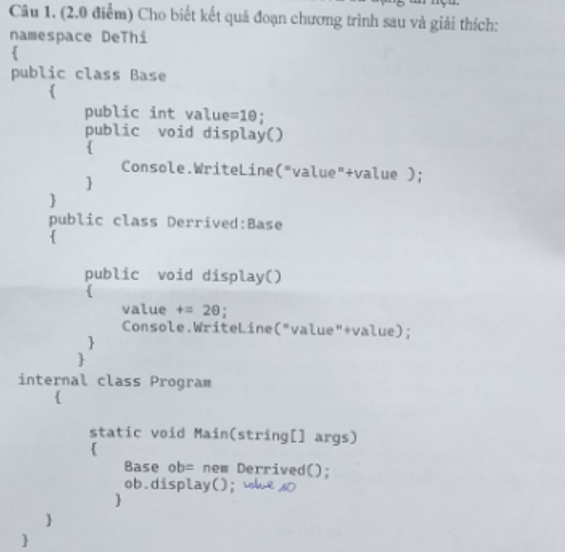
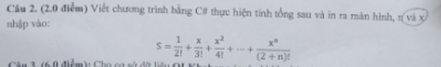

# 2024 - 2025 - HK1
### Bài l: 
 </br>
**Kết quả output:**
value10 </br>
**Giải thích:**
Trình biên dịch chọn Base.display() dựa trên kiểu khai báo (Base), không phải kiểu thực tế (Derrived).
Derrived.display() không ghi đè (override) mà chỉ che giấu (hide) phương thức cha.
Vì vậy gọi Base.display(), in value ban đầu = 10.

### Bài 2:

``` csharp
using System;

namespace Bai2
{
    class Program
    {
        // hàm tính giai thừa
        public static double GiaiThua(double num)
        {
            if (num == 0 || num == 1)
                return 1;
            else
                return num * GiaiThua(num - 1);
        }
        
        // hàm tính tổng
        public static double Sum(double x, double n)
        {
            double sum = 0;
            for (int i = 0; i <= n; i++)
            {
                sum += Math.Pow(x, i) / GiaiThua(2 + i);
            }
            return sum;
        }
        
        static void Main(string[] args)
        {
            double x, n;
            double result = 0;
            
            // Nhập giá trị x
            Console.WriteLine("Nhap vao gia tri x:");
            x = Convert.ToDouble(Console.ReadLine());
            
            // Xử lý trường hợp đặc biệt khi x = 0
            if (x == 0)
            {
                result = 1 / GiaiThua(2);
                Console.WriteLine("Ket qua la: " + result);
                return;
            }
            
            // Nhập và kiểm tra giá trị n
            Console.WriteLine("Nhap vao gia tri n:");
            while (true)
            {
                n = Convert.ToDouble(Console.ReadLine());
                if (n > -2)
                    break;
                Console.WriteLine("Gia tri cua n phai > -2. Vui long nhap lai gia tri cua n:");
            }
            
            result = Sum(x, n);
            Console.WriteLine("Ket qua la: " + result);
        }
    }
}
```


