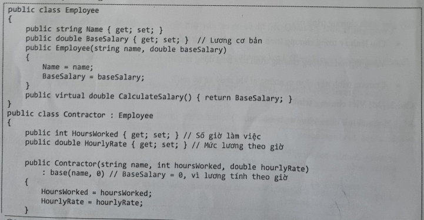
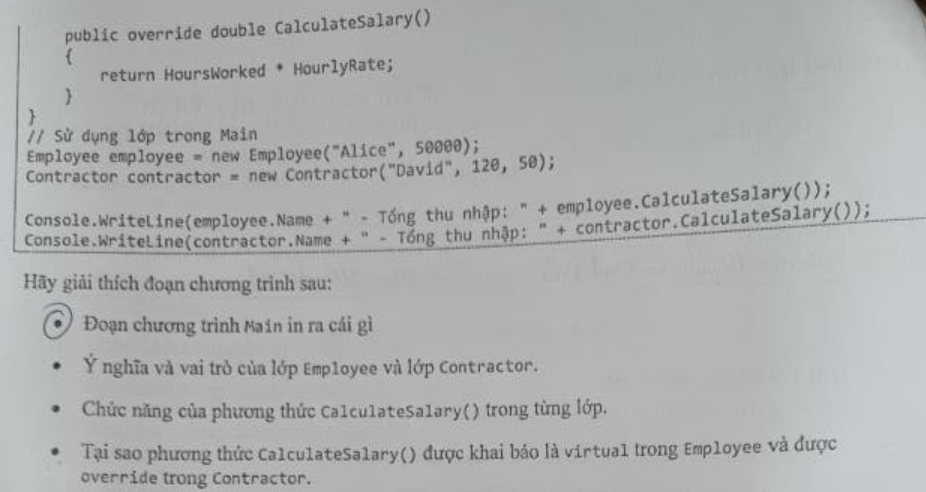
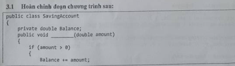
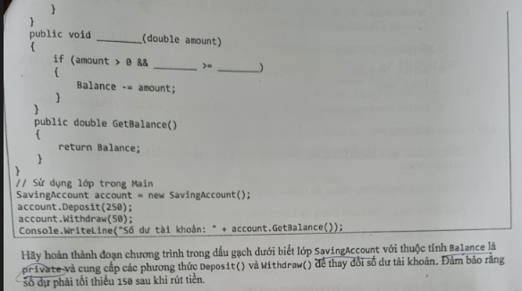
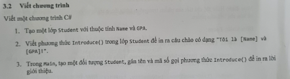
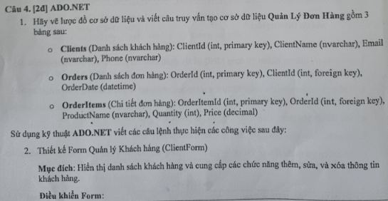
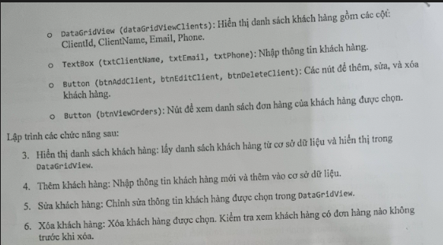
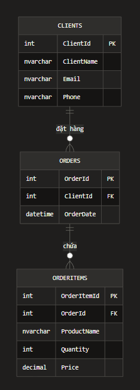
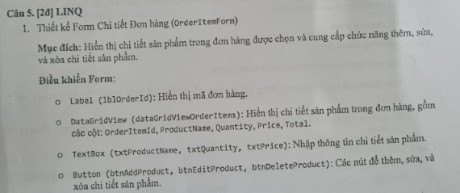
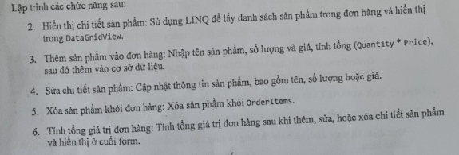

## 2024 - 2025 CLC
### Câu 1:

#### Bài làm:
1. C# là ngôn ngữ lập trình do công ty nào phát triển?
Microsoft.

2. Phương thức nào là điểm bắt đầu thực thi của chương trình C#?
Phương thức Main.

3. Phương thức nào dùng để so sánh hai chuỗi trong C#?
Equals() hoặc Compare().

4. Kiểu dữ liệu nào trong C# được dùng để lưu trữ chuỗi ký tự?
string.

5. Từ khóa this trong C# được sử dụng để làm gì?
Tham chiếu đến instance hiện tại của lớp.

6. Từ khóa ref và out khác nhau như thế nào?
    + ref: biến phải được khởi tạo trước, giá trị có thể thay đổi hoặc không trong phương thức.
    + out: biến không cần khởi tạo trước, bắt buộc phải gán giá trị trong phương thức.

7. Một lớp trong C# có thể kế thừa bao nhiêu lớp khác?
Chỉ 1 lớp (đơn kế thừa).

8. Abstract class khác Interface như thế nào trong C#? </br>
- Abstract class:
    + Có thể chứa phương thức đã triển khai và chưa triển khai.
    + Có thể có trường dữ liệu, thuộc tính, constructor.
    + Lớp chỉ kế thừa được 1 abstract class. </br>
- Interface:
    + Chỉ khai báo phương thức/property (từ C# 8.0 có thể có default implementation).
    + Không có trường dữ liệu (ngoài static).
    + Lớp có thể triển khai nhiều interface.

### Câu 2:
#### 2.1:


#### Bài làm:
+ Đoạn chương trình main in ra màn hình: </br>
Alice - Tổng thu nhập: 50000 </br>
David - Tổng thu nhập: 6000

+ Ý nghĩa và vai trò của lớp Employee và lớp Contractor: </br>
- Lớp Employee (Lớp cơ sở):
    + Đại diện cho nhân viên chính thức, có lương cố định
    + Chứa thông tin chung: tên, lương cơ bản
    + Đóng vai trò là lớp cơ sở để các loại nhân viên khác kế thừa
    + Áp dụng tính trừu tượng (abstraction) - định nghĩa cấu trúc chung </br>
- Lớp Contractor (Lớp dẫn xuất):
    + Đại diện cho nhân viên hợp đồng, tính lương theo giờ
    + Kế thừa từ Employee, mở rộng thêm thuộc tính: giờ làm, mức lương/giờ
    + Thể hiện tính kế thừa (inheritance)
    + Có cách tính lương khác với nhân viên chính thức
- Chức năng của phương thức CalculateSalary() trong từng lớp:
    + Lớp Employee: Trả về lương cố định (BaseSalary) và được đánh dấu virtual để cho phép ghi đè
    + Lớp Contractor: Ghi đè phương thức CalculateSalary() để tính lương theo công thức: HoursWorked × HourlyRate
- Tại sao phương thức CalculateSalary() được khai báo là virtual trong Employee và được override trong Contractor: vì điều này giúp thể hiện tính đa hình và dễ mở rộng hơn, 
trong bài trên có 2 lớp tính tiền lương theo 2 cách khác nhau (một là nhân viên chính thức và hai là nhân viên theo giờ). Việc khai báo Virtual như vậy giúp tích kiệm thời gian
và độ dài chương trình hơn
#### 2.2:

#### Bài làm:
+ Câu lệnh if hoạt động như thế nào và kiểm tra điều kiện gì?
Câu lệnh if ở đây kiểm tra các số nằm trong đoạn [1, 10] nếu số nào lẻ thì in ra số loại 1 và ngược lại in ra số loại 2
+ Vòng lặp while hoạt động như thế nào và khi nào kết thúc?
Khi vòng lặp kết thúc và kết quả được in ra số loại 1 hoặc loại 2. Khi đó biến number sẽ được tăng thêm 1 đơn vị và tiếp tục kiểm tra điều kiện while (number <= 10), nếu thoả mãn thì tiếp tục vòng lặp while nếu không thì vòng lặp kết thúc
+ Chương trình sẽ in ra gì khi chạy và tại sao?
output:
Số loại 1: 1
Số loại 1: 1
Số loại 1: 1
Số loại 1: 1
Số loại 1: 1
.... 
(chương trình lặp vô hạn và không có điều kiện dừng)
Tại vì mỗi lần lặp của vòng điều kiện (if) thì chương trình chỉ kiểm tra một số duy nhất là number = 1, lý do là vì vòng while () ở đây không có dấu ngoặc kép để giới hạn lại vòng lặp, nên chỉ có khối điều kiện (if) được tính là nằm trong while nên biến number chưa bao giờ được tăng lên 1 đơn vị nào

### Câu 3:
#### 3.1:


#### Bài làm:
2 hàm cần làm là: </br>
``` csharp
public void Deposit(double amount)
    {
        if (amount > 0)
        {
            Balance += amount;
        }
    }
    
    public void Withdraw(double amount)
    {
        if (amount > 0 && (Balance - amount) >= 150)
        {
            Balance -= amount;
        }
    }
```
#### 3.2:

#### Bài làm:

``` csharp
using System;

public class Student
{
    public string Name { get; set; }
    public double GPA { get; set; }
    public void Introduce()
    {
        Console.WriteLine($"Tôi là {Name} và GPA {GPA}!");
    }
}

public class Program
{
    public static void Main(string[] args)
    {
        Student student = new Student();
        
        // Gán tên và GPA
        student.Name = "Nguyễn Văn A";
        student.GPA = 3.5;
        
        // Gọi phương thức Introduce()
        student.Introduce();
    }
}
```

### Câu 4:


#### Bài làm:
Giả sử ta có cấu trúc thư mục như sau: </br>
QuanLyDonHang/
├── DatabaseHelper.cs
├── ClientForm.cs
├── ClientForm.Designer.cs
├── Program.cs
#### 1. Vẽ lược đồ cơ sở dữ liệu:

``` SQL
-- Tạo cơ sở dữ liệu
CREATE DATABASE QuanLyDonHang;
GO

USE QuanLyDonHang;
GO

-- Tạo bảng Clients
CREATE TABLE Clients (
    ClientId INT PRIMARY KEY IDENTITY(1,1),
    ClientName NVARCHAR(100) NOT NULL,
    Email NVARCHAR(100),
    Phone NVARCHAR(20)
);
GO

-- Tạo bảng Orders
CREATE TABLE Orders (
    OrderId INT PRIMARY KEY IDENTITY(1,1),
    ClientId INT NOT NULL,
    OrderDate DATETIME DEFAULT GETDATE(),
    FOREIGN KEY (ClientId) REFERENCES Clients(ClientId) ON DELETE CASCADE
);
GO

-- Tạo bảng OrderItems
CREATE TABLE OrderItems (
    OrderItemId INT PRIMARY KEY IDENTITY(1,1),
    OrderId INT NOT NULL,
    ProductName NVARCHAR(100) NOT NULL,
    Quantity INT NOT NULL CHECK (Quantity > 0),
    Price DECIMAL(18,2) NOT NULL CHECK (Price >= 0),
    FOREIGN KEY (OrderId) REFERENCES Orders(OrderId) ON DELETE CASCADE
);
GO

-- Thêm dữ liệu mẫu
INSERT INTO Clients (ClientName, Email, Phone) VALUES
(N'Nguyễn Văn A', 'a@email.com', '0912345678'),
(N'Trần Thị B', 'b@email.com', '0923456789'),
(N'Lê Văn C', 'c@email.com', '0934567890');
GO

INSERT INTO Orders (ClientId, OrderDate) VALUES
(1, '2024-01-15'),
(1, '2024-01-20'),
(2, '2024-01-25');
GO

INSERT INTO OrderItems (OrderId, ProductName, Quantity, Price) VALUES
(1, N'Laptop Dell', 1, 25000000),
(1, N'Chuột không dây', 2, 500000),
(2, N'Điện thoại Samsung', 1, 15000000),
(3, N'Máy tính bảng', 1, 8000000);
GO
```
#### Form quản lý khách hàng:
``` csharp (Lớp DatabaseHelper.cs)
using System;
using System.Data;
using System.Data.SqlClient;

namespace QuanLyDonHang
{
    public class DatabaseHelper
    {
        private string connectionString = "Server=.;Database=QuanLyDonHang;Integrated Security=True;";
        
        public DataTable GetClients()
        {
            using (SqlConnection conn = new SqlConnection(connectionString))
            {
                string query = "SELECT * FROM Clients";
                SqlDataAdapter adapter = new SqlDataAdapter(query, conn);
                DataTable dt = new DataTable();
                adapter.Fill(dt);
                return dt;
            }
        }
        
        public bool AddClient(string name, string email, string phone)
        {
            using (SqlConnection conn = new SqlConnection(connectionString))
            {
                string query = "INSERT INTO Clients (ClientName, Email, Phone) VALUES (@Name, @Email, @Phone)";
                SqlCommand cmd = new SqlCommand(query, conn);
                cmd.Parameters.AddWithValue("@Name", name);
                cmd.Parameters.AddWithValue("@Email", email);
                cmd.Parameters.AddWithValue("@Phone", phone);
                
                conn.Open();
                return cmd.ExecuteNonQuery() > 0;
            }
        }
        
        public bool UpdateClient(int clientId, string name, string email, string phone)
        {
            using (SqlConnection conn = new SqlConnection(connectionString))
            {
                string query = "UPDATE Clients SET ClientName = @Name, Email = @Email, Phone = @Phone WHERE ClientId = @Id";
                SqlCommand cmd = new SqlCommand(query, conn);
                cmd.Parameters.AddWithValue("@Id", clientId);
                cmd.Parameters.AddWithValue("@Name", name);
                cmd.Parameters.AddWithValue("@Email", email);
                cmd.Parameters.AddWithValue("@Phone", phone);
                
                conn.Open();
                return cmd.ExecuteNonQuery() > 0;
            }
        }
        
        public bool DeleteClient(int clientId)
        {
            // Kiểm tra xem khách hàng có đơn hàng không
            if (HasOrders(clientId))
            {
                return false; // Không thể xóa vì có đơn hàng
            }
            
            using (SqlConnection conn = new SqlConnection(connectionString))
            {
                string query = "DELETE FROM Clients WHERE ClientId = @Id";
                SqlCommand cmd = new SqlCommand(query, conn);
                cmd.Parameters.AddWithValue("@Id", clientId);
                
                conn.Open();
                return cmd.ExecuteNonQuery() > 0;
            }
        }
        
        private bool HasOrders(int clientId)
        {
            using (SqlConnection conn = new SqlConnection(connectionString))
            {
                string query = "SELECT COUNT(*) FROM Orders WHERE ClientId = @Id";
                SqlCommand cmd = new SqlCommand(query, conn);
                cmd.Parameters.AddWithValue("@Id", clientId);
                
                conn.Open();
                int count = Convert.ToInt32(cmd.ExecuteScalar());
                return count > 0;
            }
        }
        
        public DataTable GetClientOrders(int clientId)
        {
            using (SqlConnection conn = new SqlConnection(connectionString))
            {
                string query = @"
                    SELECT o.OrderId, o.OrderDate, 
                           COUNT(oi.OrderItemId) as TotalItems,
                           SUM(oi.Quantity * oi.Price) as TotalAmount
                    FROM Orders o
                    LEFT JOIN OrderItems oi ON o.OrderId = oi.OrderId
                    WHERE o.ClientId = @Id
                    GROUP BY o.OrderId, o.OrderDate";
                    
                SqlDataAdapter adapter = new SqlDataAdapter(query, conn);
                adapter.SelectCommand.Parameters.AddWithValue("@Id", clientId);
                DataTable dt = new DataTable();
                adapter.Fill(dt);
                return dt;
            }
        }
    }
}
```
``` csharp (Code-behind cho ClientForm.cs)
using System;
using System.Data;
using System.Windows.Forms;

namespace QuanLyDonHang
{
    public partial class ClientForm : Form
    {
        private DatabaseHelper dbHelper;
        private int selectedClientId = -1;
        
        public ClientForm()
        {
            InitializeComponent();
            dbHelper = new DatabaseHelper();
            LoadClients();
        }
        
        // 3. Hiển thị danh sách khách hàng
        private void LoadClients()
        {
            try
            {
                DataTable dt = dbHelper.GetClients();
                dataGridViewClients.DataSource = dt;
                ClearSelection();
            }
            catch (Exception ex)
            {
                MessageBox.Show("Lỗi tải dữ liệu: " + ex.Message);
            }
        }
        
        private void ClearSelection()
        {
            selectedClientId = -1;
            txtClientName.Clear();
            txtEmail.Clear();
            txtPhone.Clear();
        }
        
        // Sự kiện chọn dòng trong DataGridView
        private void dataGridViewClients_CellClick(object sender, DataGridViewCellEventArgs e)
        {
            if (e.RowIndex >= 0)
            {
                DataGridViewRow row = dataGridViewClients.Rows[e.RowIndex];
                selectedClientId = Convert.ToInt32(row.Cells["ClientId"].Value);
                txtClientName.Text = row.Cells["ClientName"].Value.ToString();
                txtEmail.Text = row.Cells["Email"]?.ToString() ?? "";
                txtPhone.Text = row.Cells["Phone"]?.ToString() ?? "";
            }
        }
        
        // 4. Thêm khách hàng
        private void btnAddClient_Click(object sender, EventArgs e)
        {
            if (string.IsNullOrWhiteSpace(txtClientName.Text))
            {
                MessageBox.Show("Vui lòng nhập tên khách hàng!");
                return;
            }
            
            try
            {
                bool success = dbHelper.AddClient(
                    txtClientName.Text.Trim(),
                    txtEmail.Text.Trim(),
                    txtPhone.Text.Trim()
                );
                
                if (success)
                {
                    MessageBox.Show("Thêm khách hàng thành công!");
                    LoadClients();
                }
                else
                {
                    MessageBox.Show("Thêm khách hàng thất bại!");
                }
            }
            catch (Exception ex)
            {
                MessageBox.Show("Lỗi: " + ex.Message);
            }
        }
        
        // 5. Sửa khách hàng
        private void btnEditClient_Click(object sender, EventArgs e)
        {
            if (selectedClientId <= 0)
            {
                MessageBox.Show("Vui lòng chọn khách hàng để sửa!");
                return;
            }
            
            if (string.IsNullOrWhiteSpace(txtClientName.Text))
            {
                MessageBox.Show("Vui lòng nhập tên khách hàng!");
                return;
            }
            
            try
            {
                bool success = dbHelper.UpdateClient(
                    selectedClientId,
                    txtClientName.Text.Trim(),
                    txtEmail.Text.Trim(),
                    txtPhone.Text.Trim()
                );
                
                if (success)
                {
                    MessageBox.Show("Cập nhật khách hàng thành công!");
                    LoadClients();
                }
                else
                {
                    MessageBox.Show("Cập nhật thất bại!");
                }
            }
            catch (Exception ex)
            {
                MessageBox.Show("Lỗi: " + ex.Message);
            }
        }
        
        // 6. Xóa khách hàng
        private void btnDeleteClient_Click(object sender, EventArgs e)
        {
            if (selectedClientId <= 0)
            {
                MessageBox.Show("Vui lòng chọn khách hàng để xóa!");
                return;
            }
            
            DialogResult result = MessageBox.Show(
                "Bạn có chắc chắn muốn xóa khách hàng này?",
                "Xác nhận xóa",
                MessageBoxButtons.YesNo,
                MessageBoxIcon.Warning
            );
            
            if (result == DialogResult.Yes)
            {
                try
                {
                    bool success = dbHelper.DeleteClient(selectedClientId);
                    
                    if (success)
                    {
                        MessageBox.Show("Xóa khách hàng thành công!");
                        LoadClients();
                    }
                    else
                    {
                        MessageBox.Show("Không thể xóa! Khách hàng có đơn hàng trong hệ thống.");
                    }
                }
                catch (Exception ex)
                {
                    MessageBox.Show("Lỗi: " + ex.Message);
                }
            }
        }
        
        // Xem đơn hàng của khách hàng
        private void btnViewOrders_Click(object sender, EventArgs e)
        {
            if (selectedClientId <= 0)
            {
                MessageBox.Show("Vui lòng chọn khách hàng!");
                return;
            }
            
            try
            {
                DataTable orders = dbHelper.GetClientOrders(selectedClientId);
                
                if (orders.Rows.Count == 0)
                {
                    MessageBox.Show("Khách hàng chưa có đơn hàng nào!");
                    return;
                }
                
                // Hiển thị đơn hàng trong DataGridView hoặc Form mới
                OrdersForm ordersForm = new OrdersForm(selectedClientId, txtClientName.Text);
                ordersForm.ShowDialog();
            }
            catch (Exception ex)
            {
                MessageBox.Show("Lỗi: " + ex.Message);
            }
        }
        
        // Làm mới danh sách
        private void btnRefresh_Click(object sender, EventArgs e)
        {
            LoadClients();
        }
    }
}
```
``` csharp (Form OrdersForm.cs)
using System;
using System.Data;
using System.Windows.Forms;

namespace QuanLyDonHang
{
    public partial class OrdersForm : Form
    {
        private int clientId;
        private DatabaseHelper dbHelper;
        
        public OrdersForm(int clientId, string clientName)
        {
            InitializeComponent();
            this.clientId = clientId;
            dbHelper = new DatabaseHelper();
            this.Text = $"Đơn hàng của khách hàng: {clientName}";
            LoadOrders();
        }
        
        private void LoadOrders()
        {
            try
            {
                DataTable dt = dbHelper.GetClientOrders(clientId);
                dataGridViewOrders.DataSource = dt;
                
                // Tính tổng
                decimal totalAmount = 0;
                foreach (DataRow row in dt.Rows)
                {
                    totalAmount += Convert.ToDecimal(row["TotalAmount"]);
                }
                lblTotal.Text = $"Tổng giá trị: {totalAmount:N0} VNĐ";
            }
            catch (Exception ex)
            {
                MessageBox.Show("Lỗi: " + ex.Message);
            }
        }
    }
}
```
``` csharp (Program.cs)
using System;
using System.Windows.Forms;

namespace QuanLyDonHang
{
    static class Program
    {
        [STAThread]
        static void Main()
        {
            Application.EnableVisualStyles();
            Application.SetCompatibleTextRenderingDefault(false);
            Application.Run(new ClientForm());
        }
    }
}
```
``` csharp (Cấu hình kết nối (App.config))
<?xml version="1.0" encoding="utf-8"?>
<configuration>
    <connectionStrings>
        <add name="QuanLyDonHangConnection" 
             connectionString="Server=.;Database=QuanLyDonHang;Integrated Security=True;"
             providerName="System.Data.SqlClient" />
    </connectionStrings>
</configuration>
```
### Câu 5:


#### Bài làm:
``` csharp (File OrderItemForm.Designer.cs (phần thiết kế)) 
namespace QuanLyDonHang
{
    partial class OrderItemForm
    {
        private System.ComponentModel.IContainer components = null;
        private Label lblOrderId;
        private DataGridView dataGridViewOrderItems;
        private Label lblProductName;
        private TextBox txtProductName;
        private Label lblQuantity;
        private TextBox txtQuantity;
        private Label lblPrice;
        private TextBox txtPrice;
        private Button btnAddProduct;
        private Button btnEditProduct;
        private Button btnDeleteProduct;
        private Label lblItemTotal;
        private Label lblTotalAmount;
        private Button btnRefresh;
        private Button btnClose;

        protected override void Dispose(bool disposing)
        {
            if (disposing && (components != null))
            {
                components.Dispose();
            }
            base.Dispose(disposing);
        }

        private void InitializeComponent()
        {
            this.lblOrderId = new Label();
            this.dataGridViewOrderItems = new DataGridView();
            this.lblProductName = new Label();
            this.txtProductName = new TextBox();
            this.lblQuantity = new Label();
            this.txtQuantity = new TextBox();
            this.lblPrice = new Label();
            this.txtPrice = new TextBox();
            this.btnAddProduct = new Button();
            this.btnEditProduct = new Button();
            this.btnDeleteProduct = new Button();
            this.lblItemTotal = new Label();
            this.lblTotalAmount = new Label();
            this.btnRefresh = new Button();
            this.btnClose = new Button();
            ((System.ComponentModel.ISupportInitialize)(this.dataGridViewOrderItems)).BeginInit();
            this.SuspendLayout();

            // lblOrderId
            this.lblOrderId.AutoSize = true;
            this.lblOrderId.Font = new Font("Microsoft Sans Serif", 12F, FontStyle.Bold, GraphicsUnit.Point, ((byte)(0)));
            this.lblOrderId.Location = new Point(20, 20);
            this.lblOrderId.Name = "lblOrderId";
            this.lblOrderId.Size = new Size(200, 25);
            this.lblOrderId.Text = "Mã đơn hàng: 00000";

            // dataGridViewOrderItems
            this.dataGridViewOrderItems.AllowUserToAddRows = false;
            this.dataGridViewOrderItems.AllowUserToDeleteRows = false;
            this.dataGridViewOrderItems.ColumnHeadersHeightSizeMode = DataGridViewColumnHeadersHeightSizeMode.AutoSize;
            this.dataGridViewOrderItems.Location = new Point(20, 60);
            this.dataGridViewOrderItems.Name = "dataGridViewOrderItems";
            this.dataGridViewOrderItems.ReadOnly = true;
            this.dataGridViewOrderItems.RowHeadersWidth = 51;
            this.dataGridViewOrderItems.RowTemplate.Height = 24;
            this.dataGridViewOrderItems.SelectionMode = DataGridViewSelectionMode.FullRowSelect;
            this.dataGridViewOrderItems.Size = new Size(750, 300);
            this.dataGridViewOrderItems.TabIndex = 0;
            this.dataGridViewOrderItems.CellClick += new DataGridViewCellEventHandler(this.dataGridViewOrderItems_CellClick);

            // lblProductName
            this.lblProductName.AutoSize = true;
            this.lblProductName.Location = new Point(20, 380);
            this.lblProductName.Name = "lblProductName";
            this.lblProductName.Size = new Size(96, 16);
            this.lblProductName.Text = "Tên sản phẩm:";

            // txtProductName
            this.txtProductName.Location = new Point(120, 377);
            this.txtProductName.Name = "txtProductName";
            this.txtProductName.Size = new Size(200, 22);
            this.txtProductName.TabIndex = 1;

            // lblQuantity
            this.lblQuantity.AutoSize = true;
            this.lblQuantity.Location = new Point(350, 380);
            this.lblQuantity.Name = "lblQuantity";
            this.lblQuantity.Size = new Size(64, 16);
            this.lblQuantity.Text = "Số lượng:";

            // txtQuantity
            this.txtQuantity.Location = new Point(420, 377);
            this.txtQuantity.Name = "txtQuantity";
            this.txtQuantity.Size = new Size(100, 22);
            this.txtQuantity.TabIndex = 2;
            this.txtQuantity.TextChanged += new EventHandler(this.txtQuantity_TextChanged);

            // lblPrice
            this.lblPrice.AutoSize = true;
            this.lblPrice.Location = new Point(550, 380);
            this.lblPrice.Name = "lblPrice";
            this.lblPrice.Size = new Size(55, 16);
            this.lblPrice.Text = "Đơn giá:";

            // txtPrice
            this.txtPrice.Location = new Point(610, 377);
            this.txtPrice.Name = "txtPrice";
            this.txtPrice.Size = new Size(150, 22);
            this.txtPrice.TabIndex = 3;
            this.txtPrice.TextChanged += new EventHandler(this.txtPrice_TextChanged);

            // btnAddProduct
            this.btnAddProduct.BackColor = Color.LightGreen;
            this.btnAddProduct.Location = new Point(20, 420);
            this.btnAddProduct.Name = "btnAddProduct";
            this.btnAddProduct.Size = new Size(100, 35);
            this.btnAddProduct.TabIndex = 4;
            this.btnAddProduct.Text = "Thêm";
            this.btnAddProduct.UseVisualStyleBackColor = false;
            this.btnAddProduct.Click += new EventHandler(this.btnAddProduct_Click);

            // btnEditProduct
            this.btnEditProduct.BackColor = Color.LightBlue;
            this.btnEditProduct.Location = new Point(130, 420);
            this.btnEditProduct.Name = "btnEditProduct";
            this.btnEditProduct.Size = new Size(100, 35);
            this.btnEditProduct.TabIndex = 5;
            this.btnEditProduct.Text = "Sửa";
            this.btnEditProduct.UseVisualStyleBackColor = false;
            this.btnEditProduct.Click += new EventHandler(this.btnEditProduct_Click);

            // btnDeleteProduct
            this.btnDeleteProduct.BackColor = Color.LightCoral;
            this.btnDeleteProduct.Location = new Point(240, 420);
            this.btnDeleteProduct.Name = "btnDeleteProduct";
            this.btnDeleteProduct.Size = new Size(100, 35);
            this.btnDeleteProduct.TabIndex = 6;
            this.btnDeleteProduct.Text = "Xóa";
            this.btnDeleteProduct.UseVisualStyleBackColor = false;
            this.btnDeleteProduct.Click += new EventHandler(this.btnDeleteProduct_Click);

            // lblItemTotal
            this.lblItemTotal.AutoSize = true;
            this.lblItemTotal.Font = new Font("Microsoft Sans Serif", 9F, FontStyle.Bold, GraphicsUnit.Point, ((byte)(0)));
            this.lblItemTotal.Location = new Point(350, 430);
            this.lblItemTotal.Name = "lblItemTotal";
            this.lblItemTotal.Size = new Size(134, 18);
            this.lblItemTotal.Text = "Thành tiền: 0 VNĐ";

            // lblTotalAmount
            this.lblTotalAmount.AutoSize = true;
            this.lblTotalAmount.Font = new Font("Microsoft Sans Serif", 10F, FontStyle.Bold, GraphicsUnit.Point, ((byte)(0)));
            this.lblTotalAmount.ForeColor = Color.Red;
            this.lblTotalAmount.Location = new Point(20, 470);
            this.lblTotalAmount.Name = "lblTotalAmount";
            this.lblTotalAmount.Size = new Size(252, 20);
            this.lblTotalAmount.Text = "Tổng giá trị đơn hàng: 0 VNĐ";

            // btnRefresh
            this.btnRefresh.Location = new Point(600, 420);
            this.btnRefresh.Name = "btnRefresh";
            this.btnRefresh.Size = new Size(80, 35);
            this.btnRefresh.TabIndex = 7;
            this.btnRefresh.Text = "Làm mới";
            this.btnRefresh.Click += new EventHandler(this.btnRefresh_Click);

            // btnClose
            this.btnClose.Location = new Point(690, 420);
            this.btnClose.Name = "btnClose";
            this.btnClose.Size = new Size(80, 35);
            this.btnClose.TabIndex = 8;
            this.btnClose.Text = "Đóng";
            this.btnClose.Click += new EventHandler(this.btnClose_Click);

            // OrderItemForm
            this.AutoScaleDimensions = new SizeF(8F, 16F);
            this.AutoScaleMode = AutoScaleMode.Font;
            this.ClientSize = new Size(800, 520);
            this.Controls.Add(this.btnClose);
            this.Controls.Add(this.btnRefresh);
            this.Controls.Add(this.lblTotalAmount);
            this.Controls.Add(this.lblItemTotal);
            this.Controls.Add(this.btnDeleteProduct);
            this.Controls.Add(this.btnEditProduct);
            this.Controls.Add(this.btnAddProduct);
            this.Controls.Add(this.txtPrice);
            this.Controls.Add(this.lblPrice);
            this.Controls.Add(this.txtQuantity);
            this.Controls.Add(this.lblQuantity);
            this.Controls.Add(this.txtProductName);
            this.Controls.Add(this.lblProductName);
            this.Controls.Add(this.dataGridViewOrderItems);
            this.Controls.Add(this.lblOrderId);
            this.Name = "OrderItemForm";
            this.Text = "Chi tiết đơn hàng";
            this.Load += new EventHandler(this.OrderItemForm_Load);
            ((System.ComponentModel.ISupportInitialize)(this.dataGridViewOrderItems)).EndInit();
            this.ResumeLayout(false);
            this.PerformLayout();
        }
    }
}
```
``` csharp (Code-behind OrderItemForm.cs)
using System;
using System.Collections.Generic;
using System.Data;
using System.Linq;
using System.Windows.Forms;

namespace QuanLyDonHang
{
    public partial class OrderItemForm : Form
    {
        private int orderId;
        private List<OrderItem> orderItems;
        private OrderItem selectedItem;
        private DatabaseHelper dbHelper;

        public OrderItemForm(int orderId, string orderInfo = "")
        {
            InitializeComponent();
            this.orderId = orderId;
            this.orderItems = new List<OrderItem>();
            this.dbHelper = new DatabaseHelper();
            
            lblOrderId.Text = $"Mã đơn hàng: {orderId}";
            if (!string.IsNullOrEmpty(orderInfo))
                this.Text = $"Chi tiết đơn hàng - {orderInfo}";
        }

        private void OrderItemForm_Load(object sender, EventArgs e)
        {
            LoadOrderItems();
            CalculateTotal();
        }

        // 2. Hiển thị chi tiết sản phẩm bằng LINQ
        private void LoadOrderItems()
        {
            try
            {
                // Lấy dữ liệu từ bảng OrderItems
                DataTable dt = dbHelper.GetOrderItems(orderId);
                
                // Sử dụng LINQ để chuyển DataTable sang List<OrderItem>
                orderItems = dt.AsEnumerable()
                    .Select(row => new OrderItem
                    {
                        OrderItemId = Convert.ToInt32(row["OrderItemId"]),
                        OrderId = Convert.ToInt32(row["OrderId"]),
                        ProductName = row["ProductName"].ToString(),
                        Quantity = Convert.ToInt32(row["Quantity"]),
                        Price = Convert.ToDecimal(row["Price"])
                    })
                    .ToList();
                
                DisplayOrderItems();
                ClearSelection();
            }
            catch (Exception ex)
            {
                MessageBox.Show($"Lỗi tải dữ liệu: {ex.Message}", "Lỗi", 
                    MessageBoxButtons.OK, MessageBoxIcon.Error);
            }
        }

        private void DisplayOrderItems()
        {
            // Sử dụng LINQ để tạo danh sách hiển thị với cột Total
            var displayList = orderItems
                .Select(item => new
                {
                    item.OrderItemId,
                    item.ProductName,
                    item.Quantity,
                    Price = item.Price.ToString("N0"),
                    Total = item.Total.ToString("N0")
                })
                .ToList();
            
            dataGridViewOrderItems.DataSource = displayList;
            
            // Định dạng cột
            if (dataGridViewOrderItems.Columns.Count > 0)
            {
                dataGridViewOrderItems.Columns["OrderItemId"].HeaderText = "Mã CT";
                dataGridViewOrderItems.Columns["ProductName"].HeaderText = "Tên sản phẩm";
                dataGridViewOrderItems.Columns["Quantity"].HeaderText = "Số lượng";
                dataGridViewOrderItems.Columns["Price"].HeaderText = "Đơn giá";
                dataGridViewOrderItems.Columns["Total"].HeaderText = "Thành tiền";
                
                dataGridViewOrderItems.Columns["OrderItemId"].Width = 70;
                dataGridViewOrderItems.Columns["ProductName"].Width = 250;
                dataGridViewOrderItems.Columns["Quantity"].Width = 80;
                dataGridViewOrderItems.Columns["Price"].Width = 100;
                dataGridViewOrderItems.Columns["Total"].Width = 120;
            }
        }

        private void dataGridViewOrderItems_CellClick(object sender, DataGridViewCellEventArgs e)
        {
            if (e.RowIndex >= 0)
            {
                int selectedId = Convert.ToInt32(dataGridViewOrderItems.Rows[e.RowIndex].Cells["OrderItemId"].Value);
                selectedItem = orderItems.FirstOrDefault(item => item.OrderItemId == selectedId);
                
                if (selectedItem != null)
                {
                    txtProductName.Text = selectedItem.ProductName;
                    txtQuantity.Text = selectedItem.Quantity.ToString();
                    txtPrice.Text = selectedItem.Price.ToString("N0");
                    lblItemTotal.Text = $"Thành tiền: {selectedItem.Total:N0} VNĐ";
                }
            }
        }

        private void ClearSelection()
        {
            selectedItem = null;
            txtProductName.Clear();
            txtQuantity.Clear();
            txtPrice.Clear();
            lblItemTotal.Text = "Thành tiền: 0 VNĐ";
        }

        // 3. Thêm sản phẩm vào đơn hàng
        private void btnAddProduct_Click(object sender, EventArgs e)
        {
            if (!ValidateInput()) return;
            
            try
            {
                // Tạo đối tượng mới
                var newItem = new OrderItem
                {
                    OrderId = orderId,
                    ProductName = txtProductName.Text.Trim(),
                    Quantity = Convert.ToInt32(txtQuantity.Text),
                    Price = Convert.ToDecimal(txtPrice.Text.Replace(",", "").Replace(".", ""))
                };
                
                // Thêm vào CSDL
                bool success = dbHelper.AddOrderItem(newItem);
                
                if (success)
                {
                    MessageBox.Show("Thêm sản phẩm thành công!", "Thành công",
                        MessageBoxButtons.OK, MessageBoxIcon.Information);
                    
                    LoadOrderItems();
                    CalculateTotal();
                    ClearSelection();
                }
                else
                {
                    MessageBox.Show("Thêm sản phẩm thất bại!", "Lỗi",
                        MessageBoxButtons.OK, MessageBoxIcon.Error);
                }
            }
            catch (Exception ex)
            {
                MessageBox.Show($"Lỗi thêm sản phẩm: {ex.Message}", "Lỗi",
                    MessageBoxButtons.OK, MessageBoxIcon.Error);
            }
        }

        // 4. Sửa chi tiết sản phẩm
        private void btnEditProduct_Click(object sender, EventArgs e)
        {
            if (selectedItem == null)
            {
                MessageBox.Show("Vui lòng chọn sản phẩm để sửa!", "Thông báo",
                    MessageBoxButtons.OK, MessageBoxIcon.Warning);
                return;
            }
            
            if (!ValidateInput()) return;
            
            try
            {
                // Cập nhật thông tin
                selectedItem.ProductName = txtProductName.Text.Trim();
                selectedItem.Quantity = Convert.ToInt32(txtQuantity.Text);
                selectedItem.Price = Convert.ToDecimal(txtPrice.Text.Replace(",", "").Replace(".", ""));
                
                // Cập nhật CSDL
                bool success = dbHelper.UpdateOrderItem(selectedItem);
                
                if (success)
                {
                    MessageBox.Show("Cập nhật sản phẩm thành công!", "Thành công",
                        MessageBoxButtons.OK, MessageBoxIcon.Information);
                    
                    DisplayOrderItems();
                    CalculateTotal();
                    ClearSelection();
                }
                else
                {
                    MessageBox.Show("Cập nhật thất bại!", "Lỗi",
                        MessageBoxButtons.OK, MessageBoxIcon.Error);
                }
            }
            catch (Exception ex)
            {
                MessageBox.Show($"Lỗi cập nhật: {ex.Message}", "Lỗi",
                    MessageBoxButtons.OK, MessageBoxIcon.Error);
            }
        }

        // 5. Xóa sản phẩm khỏi đơn hàng
        private void btnDeleteProduct_Click(object sender, EventArgs e)
        {
            if (selectedItem == null)
            {
                MessageBox.Show("Vui lòng chọn sản phẩm để xóa!", "Thông báo",
                    MessageBoxButtons.OK, MessageBoxIcon.Warning);
                return;
            }
            
            DialogResult result = MessageBox.Show(
                $"Bạn có chắc muốn xóa sản phẩm '{selectedItem.ProductName}'?",
                "Xác nhận xóa",
                MessageBoxButtons.YesNo,
                MessageBoxIcon.Question);
            
            if (result == DialogResult.Yes)
            {
                try
                {
                    bool success = dbHelper.DeleteOrderItem(selectedItem.OrderItemId);
                    
                    if (success)
                    {
                        MessageBox.Show("Xóa sản phẩm thành công!", "Thành công",
                            MessageBoxButtons.OK, MessageBoxIcon.Information);
                        
                        LoadOrderItems();
                        CalculateTotal();
                        ClearSelection();
                    }
                    else
                    {
                        MessageBox.Show("Xóa sản phẩm thất bại!", "Lỗi",
                            MessageBoxButtons.OK, MessageBoxIcon.Error);
                    }
                }
                catch (Exception ex)
                {
                    MessageBox.Show($"Lỗi xóa sản phẩm: {ex.Message}", "Lỗi",
                        MessageBoxButtons.OK, MessageBoxIcon.Error);
                }
            }
        }

        // 6. Tính tổng giá trị đơn hàng
        private void CalculateTotal()
        {
            // Sử dụng LINQ để tính tổng
            decimal totalAmount = orderItems.Sum(item => item.Total);
            lblTotalAmount.Text = $"Tổng giá trị đơn hàng: {totalAmount:N0} VNĐ";
        }

        private void CalculateItemTotal()
        {
            if (int.TryParse(txtQuantity.Text, out int qty) && 
                decimal.TryParse(txtPrice.Text.Replace(",", "").Replace(".", ""), out decimal price))
            {
                lblItemTotal.Text = $"Thành tiền: {(qty * price):N0} VNĐ";
            }
            else
            {
                lblItemTotal.Text = "Thành tiền: 0 VNĐ";
            }
        }

        private void txtQuantity_TextChanged(object sender, EventArgs e)
        {
            CalculateItemTotal();
        }

        private void txtPrice_TextChanged(object sender, EventArgs e)
        {
            CalculateItemTotal();
        }

        private bool ValidateInput()
        {
            if (string.IsNullOrWhiteSpace(txtProductName.Text))
            {
                MessageBox.Show("Vui lòng nhập tên sản phẩm!", "Lỗi",
                    MessageBoxButtons.OK, MessageBoxIcon.Warning);
                txtProductName.Focus();
                return false;
            }
            
            if (!int.TryParse(txtQuantity.Text, out int quantity) || quantity <= 0)
            {
                MessageBox.Show("Số lượng phải là số nguyên dương!", "Lỗi",
                    MessageBoxButtons.OK, MessageBoxIcon.Warning);
                txtQuantity.Focus();
                return false;
            }
            
            if (!decimal.TryParse(txtPrice.Text.Replace(",", "").Replace(".", ""), out decimal price) || price < 0)
            {
                MessageBox.Show("Giá phải là số không âm!", "Lỗi",
                    MessageBoxButtons.OK, MessageBoxIcon.Warning);
                txtPrice.Focus();
                return false;
            }
            
            return true;
        }

        private void btnRefresh_Click(object sender, EventArgs e)
        {
            LoadOrderItems();
        }

        private void btnClose_Click(object sender, EventArgs e)
        {
            this.Close();
        }
    }
}
```
``` csharp (Cập nhật lớp DatabaseHelper để hỗ trợ LINQ)
public class DatabaseHelper
{
    private string connectionString = "Server=.;Database=QuanLyDonHang;Integrated Security=True;";
    
    public DataTable GetOrderItems(int orderId)
    {
        using (SqlConnection conn = new SqlConnection(connectionString))
        {
            string query = @"
                SELECT OrderItemId, OrderId, ProductName, Quantity, Price, 
                       (Quantity * Price) as Total
                FROM OrderItems 
                WHERE OrderId = @OrderId
                ORDER BY OrderItemId";
                
            SqlDataAdapter adapter = new SqlDataAdapter(query, conn);
            adapter.SelectCommand.Parameters.AddWithValue("@OrderId", orderId);
            DataTable dt = new DataTable();
            adapter.Fill(dt);
            return dt;
        }
    }
    
    public bool AddOrderItem(OrderItem item)
    {
        using (SqlConnection conn = new SqlConnection(connectionString))
        {
            string query = @"
                INSERT INTO OrderItems (OrderId, ProductName, Quantity, Price) 
                VALUES (@OrderId, @ProductName, @Quantity, @Price)";
                
            SqlCommand cmd = new SqlCommand(query, conn);
            cmd.Parameters.AddWithValue("@OrderId", item.OrderId);
            cmd.Parameters.AddWithValue("@ProductName", item.ProductName);
            cmd.Parameters.AddWithValue("@Quantity", item.Quantity);
            cmd.Parameters.AddWithValue("@Price", item.Price);
            
            conn.Open();
            return cmd.ExecuteNonQuery() > 0;
        }
    }
    
    public bool UpdateOrderItem(OrderItem item)
    {
        using (SqlConnection conn = new SqlConnection(connectionString))
        {
            string query = @"
                UPDATE OrderItems 
                SET ProductName = @ProductName, 
                    Quantity = @Quantity, 
                    Price = @Price
                WHERE OrderItemId = @OrderItemId";
                
            SqlCommand cmd = new SqlCommand(query, conn);
            cmd.Parameters.AddWithValue("@OrderItemId", item.OrderItemId);
            cmd.Parameters.AddWithValue("@ProductName", item.ProductName);
            cmd.Parameters.AddWithValue("@Quantity", item.Quantity);
            cmd.Parameters.AddWithValue("@Price", item.Price);
            
            conn.Open();
            return cmd.ExecuteNonQuery() > 0;
        }
    }
    
    public bool DeleteOrderItem(int orderItemId)
    {
        using (SqlConnection conn = new SqlConnection(connectionString))
        {
            string query = "DELETE FROM OrderItems WHERE OrderItemId = @OrderItemId";
            SqlCommand cmd = new SqlCommand(query, conn);
            cmd.Parameters.AddWithValue("@OrderItemId", orderItemId);
            
            conn.Open();
            return cmd.ExecuteNonQuery() > 0;
        }
    }
    
    // Sử dụng LINQ để tính tổng đơn hàng
    public decimal GetOrderTotal(int orderId)
    {
        using (SqlConnection conn = new SqlConnection(connectionString))
        {
            conn.Open();
            string query = "SELECT Quantity, Price FROM OrderItems WHERE OrderId = @OrderId";
            SqlCommand cmd = new SqlCommand(query, conn);
            cmd.Parameters.AddWithValue("@OrderId", orderId);
            
            using (SqlDataReader reader = cmd.ExecuteReader())
            {
                var items = new List<OrderItem>();
                while (reader.Read())
                {
                    items.Add(new OrderItem
                    {
                        Quantity = Convert.ToInt32(reader["Quantity"]),
                        Price = Convert.ToDecimal(reader["Price"])
                    });
                }
                
                // Sử dụng LINQ để tính tổng
                return items.Sum(item => item.Quantity * item.Price);
            }
        }
    }
    
    // Sử dụng LINQ để tìm sản phẩm theo tên
    public List<OrderItem> SearchOrderItems(int orderId, string keyword)
    {
        using (SqlConnection conn = new SqlConnection(connectionString))
        {
            conn.Open();
            string query = "SELECT * FROM OrderItems WHERE OrderId = @OrderId";
            SqlCommand cmd = new SqlCommand(query, conn);
            cmd.Parameters.AddWithValue("@OrderId", orderId);
            
            using (SqlDataReader reader = cmd.ExecuteReader())
            {
                var items = new List<OrderItem>();
                while (reader.Read())
                {
                    items.Add(new OrderItem
                    {
                        OrderItemId = Convert.ToInt32(reader["OrderItemId"]),
                        ProductName = reader["ProductName"].ToString(),
                        Quantity = Convert.ToInt32(reader["Quantity"]),
                        Price = Convert.ToDecimal(reader["Price"])
                    });
                }
                
                // Sử dụng LINQ để lọc theo từ khóa
                return items
                    .Where(item => item.ProductName.ToLower().Contains(keyword.ToLower()))
                    .OrderBy(item => item.ProductName)
                    .ToList();
            }
        }
    }
}
```
``` csharp (Lớp OrderItem)
public class OrderItem
{
    public int OrderItemId { get; set; }
    public int OrderId { get; set; }
    public string ProductName { get; set; }
    public int Quantity { get; set; }
    public decimal Price { get; set; }
    public decimal Total => Quantity * Price;
    
    public override string ToString()
    {
        return $"{ProductName} - {Quantity} x {Price:N0} = {Total:N0}";
    }
}
```
``` csharp (Cách mở OrderItemForm từ OrdersForm)
// Trong OrdersForm.cs
private void dataGridViewOrders_CellDoubleClick(object sender, DataGridViewCellEventArgs e)
{
    if (e.RowIndex >= 0)
    {
        int orderId = Convert.ToInt32(dataGridViewOrders.Rows[e.RowIndex].Cells["OrderId"].Value);
        string orderDate = Convert.ToDateTime(dataGridViewOrders.Rows[e.RowIndex].Cells["OrderDate"].Value)
            .ToString("dd/MM/yyyy");
        
        OrderItemForm orderItemForm = new OrderItemForm(orderId, $"Ngày {orderDate}");
        orderItemForm.ShowDialog();
    }
}
```
``` csharp (Demo LINQ nâng cao trong OrderItemForm)
// Thêm các chức năng LINQ nâng cao
private void btnAnalyze_Click(object sender, EventArgs e)
{
    // Phân tích đơn hàng bằng LINQ
    
    // 1. Tổng số lượng sản phẩm
    int totalQuantity = orderItems.Sum(item => item.Quantity);
    
    // 2. Sản phẩm có giá cao nhất
    var mostExpensive = orderItems.OrderByDescending(item => item.Price).FirstOrDefault();
    
    // 3. Nhóm sản phẩm theo giá
    var groupedByPrice = orderItems
        .GroupBy(item => item.Price > 1000000 ? "Cao" : "Thấp")
        .Select(g => new
        {
            Category = g.Key,
            Count = g.Count(),
            Total = g.Sum(i => i.Total)
        })
        .ToList();
    
    // 4. Tìm sản phẩm theo tên (case-insensitive)
    var searchResults = orderItems
        .Where(item => item.ProductName.IndexOf("laptop", StringComparison.OrdinalIgnoreCase) >= 0)
        .ToList();
    
    // Hiển thị kết quả
    string analysis = $"Tổng số lượng: {totalQuantity}\n";
    analysis += $"Sản phẩm đắt nhất: {mostExpensive?.ProductName} - {mostExpensive?.Price:N0}\n";
    
    foreach (var group in groupedByPrice)
    {
        analysis += $"{group.Category}: {group.Count} sản phẩm, tổng {group.Total:N0}\n";
    }
    
    MessageBox.Show(analysis, "Phân tích đơn hàng");
}
```

